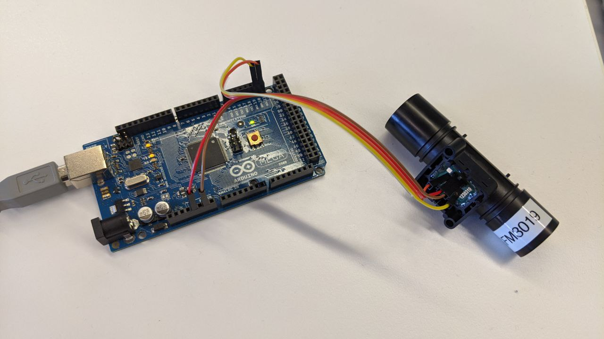
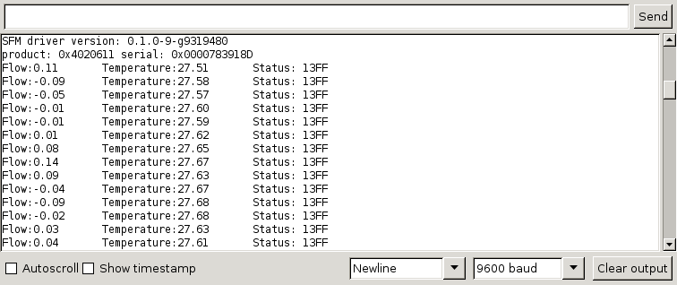

# SFM3019 Sample Code for Arduino

This Arduino sample project shows the basic usage of Sensirion's SFM3019 flow
sensor.

## Compatibility

The code herein is compatible with Sensirion's SFM3019 digital flow sensor.

* Sensirion SFM3019 Sensor
* Arduino (1.8)

## System Requirements

 * An Arduino board (Arduino Mega 2560 in this example)
 * The Arduino IDE version 1.8.12
 * SFM3019 sensor

## Getting Started

 1. Download the Arduino 1.8.12 from the [arduino website](https://www.arduino.cc/en/main/software).
 2. Connect the SFM3019 sensor to the Arduino board:

    |Arduino Mega 2560|SFM3019 Sensor|
    |-----------------|--------------|
    | 5V              | VDD (2)      |
    | GND             | GND (3)      |
    | SDA (20)        | SDA (4)      |
    | SCL (21)        | SCL (1)      |

    If you are using a different Arduino board you may need to connect VDD to
    3.3V.

    

 3. Connect the Arduino board to your computer with the USB cable.
 4. Open the the file `sfm3019/sfm3019.ino` with the Arduino IDE
 5. Select the correct Board from the *Tools->Board* menu
 6. Press the verify and then the upload button
 7. Use *Tools->Serial Monitor* to verify that everything works.

    

## Further Information

Sensirion's developer page
[developer.sensirion.com](https://developer.sensirion.com) provides more
developer resources for different platforms and products.
Also the [SFM3019 product page](https://www.sensirion.com/sfm3019/) has more
detailed information about the sensor.
